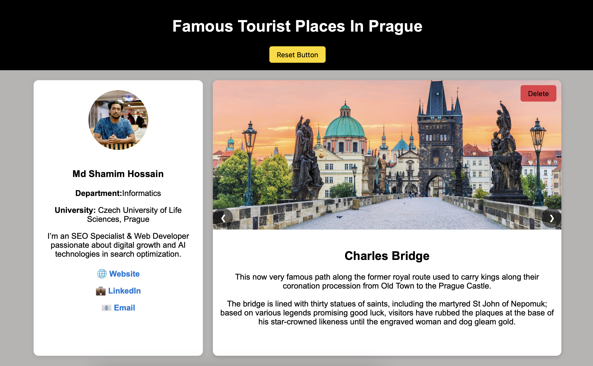

## 🌆 Famous Tourist Places in Prague

A beautiful and responsive website built using **HTML**, **CSS**, and **JavaScript**, showcasing the most famous tourist attractions in **Prague, Czech Republic**. The site features an interactive **carousel**, detailed information about landmarks, and a **personal portfolio sidebar** for the developer.


## ✨ Features

* 🎠 **Responsive Image Carousel:**
  Explore stunning images of Prague’s top attractions with smooth transitions.

* 🏰 **Attraction Sections:**
  Each section displays detailed information about famous places like **Charles Bridge**, **Prague Castle**, **Old Town Square**, and more.

* 🧹 **Delete & Reset Functionality:**
  Users can temporarily remove sections and restore them anytime with a **reset button**.

* 👨‍💻 **Personal Portfolio Sidebar:**
  A sidebar showcasing the developer’s profile, skills, and contact links.

* 📱 **Fully Responsive Design:**
  Works seamlessly across desktop, tablet, and mobile devices.


## 🛠️ Technologies Used

* **HTML5** – Structure and content
* **CSS3** – Styling and layout (responsive design, animations)
* **JavaScript (ES6)** – Carousel functionality and interactive features


## 🚀 Getting Started

### 🔧 How to Run Locally

1. **Clone this repository**

   ```bash
   git clone https://github.com/shamim-dot-in/Famous-Tourist-Places-In-Prague.git
   ```
2. **Navigate to the project folder**

   ```bash
   cd Famous-Tourist-Places-In-Prague
   ```
3. **Open `index.html`** in your browser
   No additional setup required — it’s a simple front-end project.


## 📁 Project Structure

```
Famous-Tourist-Places-In-Prague/
│
├── index.html          # Main HTML file
├── style.css           # All styling and responsive design
├── script.js           # Carousel and interactivity logic
├── images/             # Folder containing tourist place images
└── README.md           # Project documentation
```


## 🌍 Tourist Spots Featured

* Prague Castle 🏰
* Charles Bridge 🌉
* St. Vitus Cathedral ⛪
* Astronomical Clock 🕰️
* Head Of FRANZ KAFKA


## 👨‍🎨 Developer Portfolio Sidebar

The sidebar includes:

* Developer’s photo
* Short bio
* Contact info & social media links


## 📸 Preview




📬 Contact

**Md Shamim Hossain**
🌐 [Portfolio Website](https://shamim.in)
📧 [engrshamim999@gmail.com](mailto:engrshamim999@gmail.com)
💼 [LinkedIn](https://linkedin.com/in/your-profile)
🐙 [GitHub](https://github.com/shamim-dot-in)
